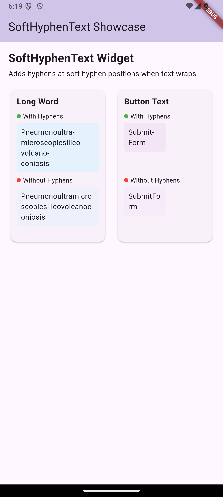

<!--
This README describes the package. If you publish this package to pub.dev,
this README's contents appear on the landing page for your package.

For information about how to write a good package README, see the guide for
[writing package pages](https://dart.dev/guides/libraries/writing-package-pages).

For general information about developing packages, see the Dart guide for
[creating packages](https://dart.dev/guides/libraries/create-library-packages)
and the Flutter guide for
[developing packages and plugins](https://flutter.dev/developing-packages).
-->

# SoftHyphenText

This widget can be used like the text widget but takes care of soft hyphens inside strings and wraps the text accordingly.


## Features

- Handles soft hyphens (U+00AD) in text
- Automatically adds visible hyphens when text wraps at a soft hyphen position
- Preserves original text when no wrapping occurs



## Getting started

Add the package to your `pubspec.yaml`:

```yaml
dependencies:
  soft_hyphen_text: ^0.0.1
```

## Usage

Simply use the `SoftHyphenText` widget instead of the standard `Text` widget:

```dart
SoftHyphenText(text: 'Hello­world')
```

The soft hyphen character (U+00AD) is invisible but indicates potential hyphenation points. When the text wraps at these points, a visible hyphen will be displayed.

### Example with different container widths

```dart
Column(
  children: [
    Container(
      width: 80,
      child: SoftHyphenText(text: 'TextWithSoftHyphenCharacter'),
    ),
  ],
)
```

## Additional information

- All standard `Text` widget properties like `style`, `textAlign`, etc. are supported.
